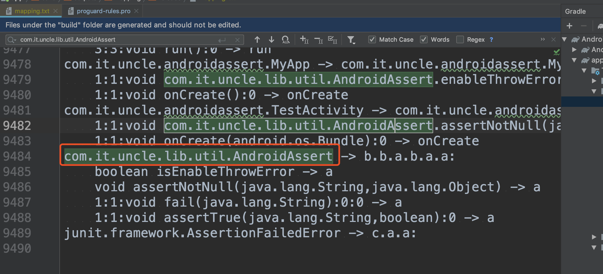
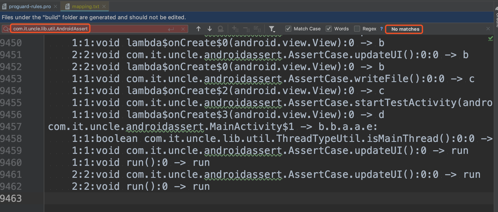
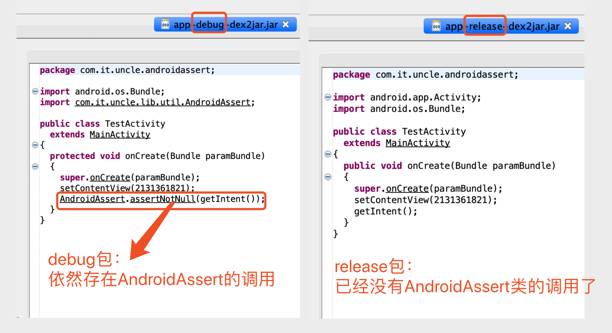

[  ](https://bintray.com/vectorzeng/maven/android-assert/0.0.2/link)

- [x] 一、简介
- [x] 二、什么是断言，什么情况下应该使用androidAssert？
- [x] 三、在release版本中移除断言代码，只在debug中保留
- [x] 四、集成AndroidAssert库
- [x] 五、API


[blog](https://juejin.im/post/5ed670e56fb9a047a96a7c9f)
[readme中的截图不显示的话，点这里](https://juejin.im/post/5ed670e56fb9a047a96a7c9f)


## 一、简介

>  android-assert是一个非常简单轻量的android断言库。类似于junit的Assert类。
>
> android-assert不是用来写测试用例的，可以直接在项目代码中使用他。
>
> 在debug模式下，断言失败将会抛出断言异常 AssertionFailedError，在release模式下，将不会抛出异常。


## 二、什么是断言，什么情况下应该使用androidAssert？

通常断言(assert)是用在单元测试，用来校验函数返回的结果。用在自动化测试用来校验程序运行结果。

但是我们接下来要讨论的并不是单元测试中使用断言，而是在项目业务代码中使用断言。

我们一起来看几个，大家非常熟悉的例子。这些情况下使用断言会让代码更加优雅，更加健壮。


### 例子1，writeFile

```java
/**
 * 我们希望只在子线程中调用writeFile()，主线程中调用可能会导致ui卡顿或者anr。
 *
 * 如果在主线程调用writeFile()，我们打印日志警告开发者
 */
public void writeFile() {
    //主线程，打印日志警告开发者
    if(!ThreadTypeUtil.isSubThread()){
        Log.e(TG, "you should call writeFile at sub thread");
    }
    // write file ...
}
```

当出现有开发人员，尝试在主线程中调用writeFile()方法时，我们通过 **日志警告** ，开发者。但是，日志提示很弱，往往会被开发者忽略掉。

**于是我们改良了下代码：**

```java
public void writeFile() {
    //debug版本，主线程中调用 writeFile ，直接抛出异常中断程序运行
    if(!ThreadTypeUtil.isSubThread()){
        if(BuildConfig.DEBUG) {
            throw new RuntimeException("you should call writeFile at sub thread");
        }
    }
    // write file ...
}
```

当程序员企图在主线程中调用writeFile()，在debug模式下，我们直接抛出异常，让程序崩溃。以中断他的开发。强制他优化代码。

我们引入断言库，**继续改造代码，让代码更简洁漂亮：**

```java
/**
 * 在debug模式，下将直接抛出异常 AssertionFailedError。让开发者
 * 在release模式，不会抛出异常，会正常执行writeFile()函数。
 */
public void writeFile() {
    AndroidAssert.assertSubThread();
    // write file ...
    Log.i(TG, "writeFile...");
}
```

AndroidAssert.assertSubThread()断言为子线程的意思是，**断定当前线程一定是子线程，如果不是，那么抛出异常 AssertionFailedError**。


**继续优化**

> 只有在debug版本，AndroidAssert 类，才有用；
>
> 在release版本的apk上，**能否把 AndroidAssert 相关调用的代码删除？**
>
> 我们先挖个坑，把例子讲完，再将release删除代码的方法。大家先忍一忍。


### 例子2，updateUI

```java
/**
 * 在release版本，如果在子线程中调用updateUI，我们直接return，不做ui更新操作。
 * 但是在debug版本，如果在子线程中调用updateUI，直接出异常，让开发者发现异常调用并解决。
 */
public void updateUI() {
    boolean isMainThread = ThreadTypeUtil.isMainThread();
    if (!isMainThread) {
        AndroidAssert.fail("updateUI must be called at main thread");
        return;
    }
    //update ui ....
    Log.i(TG, "updateUI...");
}
```


### 例子3，startMainActivity

```java
/**
 * 断言context为非空，如果为null，debug模式下抛出异常 AssertionFailedError
 */
public void startMainActivity(Context context) {
    AndroidAssert.assertNotNull("context must not null", context);
    if (context == null) {
        return;
    }
    //startMainActivity...
    Log.i(TG, "startMainActivity...");
}
```


## 三、我们继续改良，例子1，在release版本中移除断言代码，只在debug中保留

> 只有在debug版本，AndroidAssert 类，才有用；
>
> 在release版本的apk上，**能否把 AndroidAssert 相关调用的代码删除？**
>
> 或者说打包的时候，把 AndroidAssert 相关的调用的代码 和 AndroidAssert类的代码 全部删除，再打包。

于是我想到了proguard。

在proguard中添加如下配置即可：

```pro
# -dontoptimize ## 注意注意注意，proguard中配置dontoptimize；将会导致proguard不做代码优化，不会删除AndroidAssert类
-assumenosideeffects class com.it.uncle.lib.util.AndroidAssert{
    public *;
}
```

注意，注意，千万注意：**不能开-dontoptimize，开了，-assumenosideeffects将失效**


对assumenosideeffects用法有疑惑的可以，看下这篇blog：https://blog.csdn.net/jiese1990/article/details/21752159

以及官方wiki:https://www.guardsquare.com/en/products/proguard/manual/usage#assumenosideeffects


**校验assumenosideeffects是否生效**

1. 配置成功后，打包在mapping中搜索：com.it.uncle.lib.util.AndroidAssert

proguard未配置 -assumenosideeffects 的mapping.txt文件




proguard配置了 -assumenosideeffects 的mapping.txt文件:




2. 反编译debug和release包对比。

比如，我们demo里的[TestActivity](app/src/main/java/com/it/uncle/androidassert/TestActivity.java)

```java
public class TestActivity extends MainActivity {

    @Override
    protected void onCreate(@Nullable Bundle savedInstanceState) {
        super.onCreate(savedInstanceState);
        setContentView(R.layout.activity_test);

        AndroidAssert.assertNotNull(getIntent());
    }
}
```

我们分别反编译debug和release包，找到TestActivity类的代码对比：




## 四、集成AndroidAssert库

- gradle引入

  ```gradle
  implementation 'com.ituncle:android-assert:0.0.2'
  ```

- 初始化sdk，尽早调用，建议在Application#onCreate的时候调用。

```java
//初始化----断言失败时，是否抛出异常
AndroidAssert.enableThrowError(BuildConfig.DEBUG);//我们设置为debug模式下，断言失败才抛出异常
```

- 添加proguard，在开启混淆的版本中，移除AndroidAssert的代码

  ```pro
  # -dontoptimize ## 注意注意注意，proguard中配置dontoptimize；将会导致proguard不做代码优化，不会删除AndroidAssert类
  -assumenosideeffects class com.it.uncle.lib.util.AndroidAssert{
      public *;
  }
  ```

  

## 无、API

```java
public class AndroidAssert {

    /**
     * 尽早调用，建议在Application#onCreate的时候调用。
     *
     * @param enable 当断言失败时，是否抛出异常 AssertionFailedError
     */
    public static void enableThrowError(boolean enable){}

    /**
     * 断言失败，抛出断言异常
     */
    public static void fail(){}
    public static void fail(String message){}


    /////// ↓↓↓↓↓↓↓↓↓↓↓↓↓↓↓↓↓↓ thread ↓↓↓↓↓↓↓↓↓↓↓↓↓↓↓↓↓↓

    /**
     * 检查当前是否是子线程，如果不是，抛出断言异常
     */
    public static void assertSubThread() {}

    /**
     * 检查当前是否是主线程，如果不是，抛出断言异常
     */
    public static void assertMainThread() {}


    /////// ↓↓↓↓↓↓↓↓↓↓↓↓↓↓↓↓↓↓ null or nunNull ↓↓↓↓↓↓↓↓↓↓↓↓↓↓↓↓↓↓

    /**
     * 检查object是否为为非空，如果为空，抛出断言异常
     */
    public static void assertNotNull(Object object) {}
    public static void assertNotNull(String message, Object object) {}

    /**
     * 检查object是否为null，如果不是null，抛出断言异常
     */
    public static void assertNull(Object object) {}
    public static void assertNull(String message, Object object) {}


    /////// ↓↓↓↓↓↓↓↓↓↓↓↓↓↓↓↓↓↓ true or false ↓↓↓↓↓↓↓↓↓↓↓↓↓↓↓↓↓↓

    /**
     * @param condition 不是true，将抛出断言异常
     */
    public static void assertTrue(boolean condition) {
        assertTrue(null, condition);
    }
    public static void assertTrue(String message, boolean condition) {}

    /**
     * @param condition 不是false，将抛出断言异常
     */
    public static void assertFalse(boolean condition) {}
    public static void assertFalse(String message, boolean condition) {}


  
    /////// ↓↓↓↓↓↓↓↓↓↓↓↓↓↓↓↓↓↓ same ↓↓↓↓↓↓↓↓↓↓↓↓↓↓↓↓↓↓
    /**
     * expected == actual为false，抛出断言异常
     */
    public static void assertSame(Object expected, Object actual) {}
    public static void assertSame(String message, Object expected, Object actual) {}

    /**
     * object != actual为false，抛出断言异常
     */
    public static void assertNotSame(Object expected, Object actual) {}
    public static void assertNotSame(String message, Object expected,
                                     Object actual) {}


    /////// ↓↓↓↓↓↓↓↓↓↓↓↓↓↓↓↓↓↓ equals ↓↓↓↓↓↓↓↓↓↓↓↓↓↓↓↓↓↓

    /**
     * 检查expected、actual两个对象equals是否为true，如果为false那么抛出断言异常
     */
    public static void assertEquals(Object expected, Object actual) {}
    public static void assertEquals(String message, Object expected,
                                    Object actual) {}
    public static void assertEquals(boolean expected, boolean actual) {}
    public static void assertEquals(byte expected, byte actual) {}
    public static void assertEquals(char expected, char actual) {}
    public static void assertEquals(int expected, int actual) {}
		// ...
}
```

